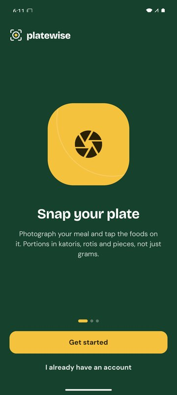
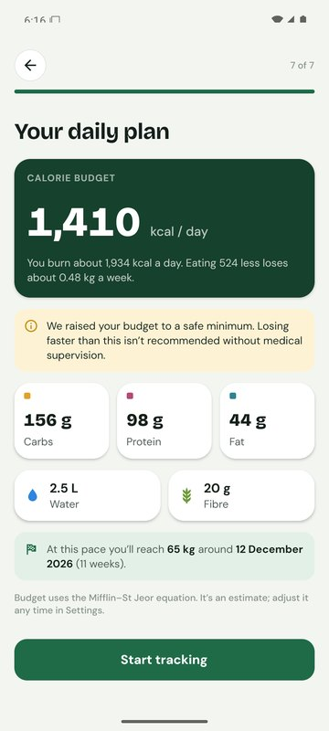
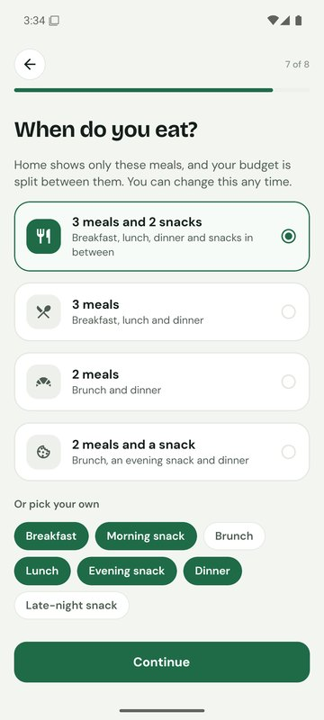
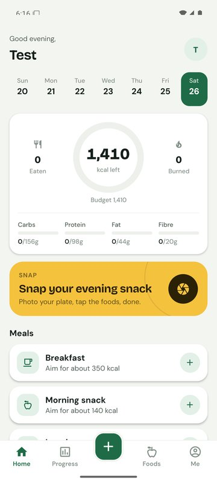
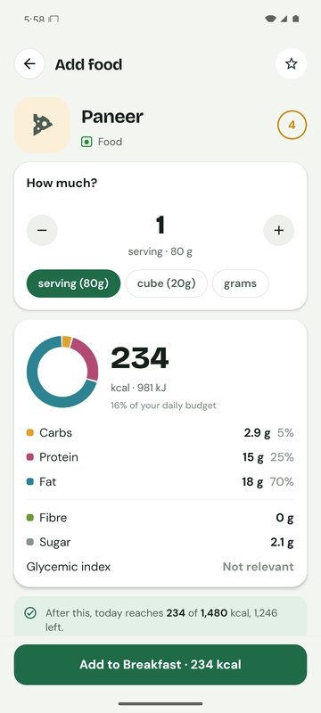
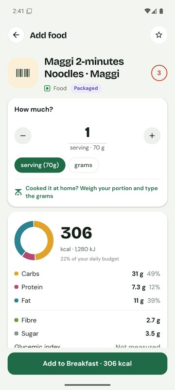

# Platewise

A food recognition and calorie counting app built for Indian home food. **Take or upload a photo
of your food and Platewise identifies it and shows its nutrition**: calories, kilojoules, carbs,
protein, fat, fibre, sugar, glycemic index and serving size. You can also scan the barcode or QR
code on a packet, or search over 6,000 Indian and international foods with portions in katoris,
rotis and pieces. Cooked it yourself? Weigh your portion and type the exact grams. Eat twice a
day? Pick your own meals, like brunch and dinner. A simple weight log shows how you're moving
towards your goal.

Built with Expo (React Native). Runs on **Android**, **iOS** and in a **web browser**. Works fully
offline with no account, and can optionally sync to your own free Firebase project.

<p>
  
  
  
  
  
  
</p>

## Contents

1. [Use it yourself: the short version](#use-it-yourself-the-short-version)
2. [Features](#features)
3. [Scope checklist](#scope-checklist)
4. [Quick start: run it in 5 minutes](#quick-start-run-it-in-5-minutes)
5. [Optional: cloud accounts, sync, Google sign-in and AI](#optional-cloud-accounts-sync-google-sign-in-and-ai-firebase)
6. [Build an installable Android app (APK)](#build-an-installable-android-app-apk)
7. [Run on an Android emulator](#run-on-an-android-emulator)
8. [iPhone and iOS](#iphone-and-ios)
9. [Project structure](#project-structure)
10. [Commands](#commands)
11. [Where your data goes](#where-your-data-goes)
12. [Food data](#food-data)
13. [How food recognition works](#how-food-recognition-works)
14. [Troubleshooting](#troubleshooting)
15. [Contributing](#contributing)
16. [License](#license)

## Use it yourself: the short version

Everything below is explained step by step further down. In short:

1. **Install** [Git](https://git-scm.com/downloads), [Node.js](https://nodejs.org) (LTS) and, on your
   phone, **Expo Go** ([Android](https://play.google.com/store/apps/details?id=host.exp.exponent) ·
   [iPhone](https://apps.apple.com/app/expo-go/id982107779)).
2. **Download and install:** `git clone https://github.com/ixpavi/platewise.git`, then `cd platewise`
   and `npm install`.
3. **Run it:** `npx expo start`, then scan the QR code with Expo Go (or press `w` for the browser).
   Pick **Use without an account** and you can search, scan barcodes and log food straight away.
4. **For photo recognition, cloud accounts and sync**, create your own free Firebase project and
   put its settings in a `.env` file ([steps 1 to 5](#step-1-create-a-firebase-project)), then turn on
   **AI Logic** ([step 7](#step-7-ai-features-photo-recognition-and-helpers)). Each copy of the app uses its
   own Firebase project; this repository contains no keys.
5. **For a real app on your phone**, build an APK ([Windows script or Gradle](#build-an-installable-android-app-apk))
   and sign it with your own key before sharing it.

## Features

| Area | What you get |
| --- | --- |
| Splash and login | Splash screen with the logo, name and "Know what you eat", then Home if you're logged in, or the welcome and login screens: email and password, create account, forgot password, or Google. |
| Onboarding | 8 short steps: goal (weight loss, healthy eating, weight gain or fitness), name, sex and age, height, weight, target, activity, diet, meals. Builds a daily calorie budget with the Mifflin–St Jeor equation and never goes below a safe minimum. |
| Your meals | Pick the meals you actually eat: 3 meals and 2 snacks, 3 meals, brunch and dinner, or any mix (breakfast, brunch, lunch, snacks, dinner, late-night snack). Home, the budget split and reminders follow your choice. |
| Home | "Welcome, name", a large **Scan your food** card, recent scans, week strip, calorie ring (eaten, budget, left), carbs / protein / fat / fibre bars, your meals, weight, daily tip. |
| Scan food (recognition) | Take a photo or upload one → preview (**Analyse food** / **Retake**) → "Identifying your food…" → nutrition result. Gemini names each food and its portion, the food database gives the nutrition: calories, kJ, carbs, protein, fat, fibre, sugar, glycemic index (low / medium / high), serving size and category. Tap a food for its full detail. Adjust portions, remove or add foods, then log it, **Scan again** or go **Back to home**. The photo is saved with the meal. Without AI set up, you tap the foods yourself. |
| Categories | Food, Drink, Dessert and Other, each with its foods. |
| Barcode and QR scanner | Scan an EAN / UPC barcode, or the GS1 QR code on newer packs (or type the digits), to look up a packaged food on Open Food Facts. |
| Food search | Over 6,000 foods: 139 hand-picked everyday foods, about 900 Indian recipes (INDB) and about 5,000 international foods as eaten (USDA). Typo-tolerant search, Hindi names, veg / egg / non-veg marks, favourites, health score. |
| Your own foods | Type in the values from a label, a restaurant menu or a delivery app for one serving. The weight is optional: without it you log by servings, and the calories are exactly what you entered. Handy for branded dishes (a delivery biryani can have far more calories than a home-style one). |
| Portions | Household units (katori, roti, piece, cup) or the exact weight in grams or ml. Calories update as you type. |
| Weight | A simple weight log with progress towards your goal and a trend chart. |
| Progress | 7 and 30 day calorie charts against your budget, macro averages, weight trend, top calorie sources. |
| Reminders | Reminders for your main meals at times you choose. Scheduled on the phone, no server. |
| Profile | Name, height, gender, age and goal, your calorie plan and BMI, settings, and **Log out** (back to the login screen). |
| Accounts | "This phone only" accounts (no internet needed), or cloud accounts with email / password or Google that sync across phones and the web. |
| AI helpers | Food recognition (above), reading a nutrition label, menu or screenshot to fill in a new food, finding the values a brand or restaurant publishes (Google Search), and estimating a dish the database doesn't have. Uses Gemini through Firebase AI Logic, so no AI key is stored in the app. See [step 7](#step-7-ai-features-photo-recognition-and-helpers). |
| Errors handled | "We couldn't identify this food" (try again or select the food manually), "Please check your internet connection", "Nutrition information for this food is currently unavailable" (select another food), and camera permission requests. |

## Scope checklist

How the app covers the project's scope and framework document.

| Requirement | Where it is |
| --- | --- |
| Bottom navigation: Home, Scan Food, Categories, Profile | Tab bar: Home, Progress, **Scan** (centre), Categories, Profile. Hold Scan for more ways to log. |
| Screen 1, splash | `src/app/index.tsx`: logo, name, "Know what you eat"; then Home if logged in, otherwise login |
| Screen 2, login | `src/app/welcome.tsx`, `src/app/auth.tsx`: email and password, create account, forgot password |
| Screen 3, home | `src/app/(tabs)/index.tsx`: welcome, **Scan your food** card, recent scans |
| Screens 4 and 5, scan food and camera | `src/app/snap.tsx`: take photo or upload photo, preview with **Analyse food** and **Retake** |
| Screen 6, recognition | `src/app/snap.tsx` and `src/lib/recognition.ts`: "Identifying your food…", image → food names → food database → nutrition |
| Screen 7, nutrition result | `src/app/snap.tsx`: calories, kJ, carbs, protein, fat, fibre, sugar, GI, serving size, category; **Scan again**, **Select another food**, **Back to home** |
| Screen 8, food detail | `src/app/food/[id].tsx`: name, category, serving size, calories, kJ, protein, carbs, fat, fibre, sugar, GI, health score |
| Screen 9, profile | `src/app/(tabs)/profile.tsx`: name, height, gender, goal (weight loss, weight gain, healthy eating, fitness) |
| Logout | Profile → Log out → login screen |
| FR-01 to FR-09 | Login, profile, image capture, image upload, recognition, nutrition lookup, nutrition display, scan again, logout: all of the above |
| Food categories | Food, Drink, Dessert, Other (`src/data/foods.ts`, Categories tab) |
| Database | Firebase Authentication (users), Firestore (profile, goal, food logs with scan photos, your own foods), food database of over 6,000 foods in the app |
| Recognition layer kept separate | `src/lib/recognition.ts` (the `Recognizer` interface): swap the model or API without touching the screens |
| Error handling | Food not recognised, no internet, nutrition unavailable, camera permission |
| Technology | React Native (Expo), Firebase, Firestore, Google Gemini through Firebase AI Logic |

## Quick start: run it in 5 minutes

You don't need Android Studio, Xcode, Firebase or any account for this.

### 1. Install the tools

| Tool | Where to get it | Check it works |
| --- | --- | --- |
| **Git** | https://git-scm.com/downloads | `git --version` |
| **Node.js** 20.19.4+, 22.13+ or 24.3+ (the LTS version is best) | https://nodejs.org | `node -v` |
| **Expo Go** app on your phone (optional) | [Play Store](https://play.google.com/store/apps/details?id=host.exp.exponent) · [App Store](https://apps.apple.com/app/expo-go/id982107779) | Opens on the phone |

npm comes with Node.js. Windows, macOS and Linux all work.

### 2. Download the code

```bash
git clone https://github.com/ixpavi/platewise.git
cd platewise
```

(Or on GitHub click **Code → Download ZIP**, unzip it, and open a terminal in that folder.)

### 3. Install the packages

```bash
npm install
```

This takes a few minutes the first time.

### 4. Start the app

```bash
npx expo start
```

A QR code and a menu appear in the terminal. Leave this terminal open while you use the app.

### 5. Open it

- **On an Android phone:** open **Expo Go** and tap **Scan QR code**, then scan the code in the terminal.
- **On an iPhone:** open the **Camera** app, point it at the QR code and tap the banner. It opens in Expo Go.
- **In a browser:** press `w` in the terminal (or run `npm run web`). It opens at http://localhost:8081.

Your phone and computer must be on the **same Wi-Fi**. If the phone can't connect (office Wi-Fi,
hotspots and some routers block it), stop the server with `Ctrl + C` and use a tunnel instead:

```bash
npx expo start --tunnel
```

### 6. First run

1. Tap **Get started**.
2. Tap **Use without an account (this phone only)**, enter a name, email and password. Nothing leaves the phone.
3. Answer the 8 onboarding questions to get your calorie plan.
4. Want to see the charts filled in? Go to **Profile → Meals, budget and reminders → Load a sample week**.

Everything works in this mode except AI food recognition, cloud sync and Google sign-in, which
need the Firebase setup below. Without it, **Scan food** still works: after the photo you tap the
foods yourself. The barcode scanner needs an internet connection.

## Optional: cloud accounts, sync, Google sign-in and AI (Firebase)

With Firebase set up, people can create an account with email or Google, their logs sync between
phones and the web app, and the AI features (food recognition from photos) work. Firebase's free
**Spark** plan is enough. It takes about 15 minutes.

### Step 1: create a Firebase project

1. Go to https://console.firebase.google.com and sign in with a Google account.
2. Click **Create a project** (or **Add project**), give it a name, and finish the wizard.
   Google Analytics is not needed; you can turn it off.

### Step 2: register a web app and copy its settings

The app uses the Firebase JavaScript SDK on every platform, so it only needs the web app settings.

1. On the project's home page click the **Web** icon (`</>`), give it a nickname such as
   `platewise-web`, and click **Register app**. Don't set up Firebase Hosting.
2. Firebase shows a `firebaseConfig` block. Keep that page open.
3. In the project folder, copy the example settings file:

   ```bash
   # macOS / Linux / Git Bash
   cp .env.example .env
   ```

   ```bat
   :: Windows Command Prompt
   copy .env.example .env
   ```

4. Open `.env` in a text editor and fill in the values from `firebaseConfig`:

   | `firebaseConfig` field | Line in `.env` |
   | --- | --- |
   | `apiKey` | `EXPO_PUBLIC_FIREBASE_API_KEY=` |
   | `authDomain` | `EXPO_PUBLIC_FIREBASE_AUTH_DOMAIN=` |
   | `projectId` | `EXPO_PUBLIC_FIREBASE_PROJECT_ID=` |
   | `storageBucket` | `EXPO_PUBLIC_FIREBASE_STORAGE_BUCKET=` |
   | `messagingSenderId` | `EXPO_PUBLIC_FIREBASE_MESSAGING_SENDER_ID=` |
   | `appId` | `EXPO_PUBLIC_FIREBASE_APP_ID=` |

   Paste the values without quotes, for example `EXPO_PUBLIC_FIREBASE_PROJECT_ID=my-platewise`.

You can find these again later under **Project settings (gear icon) → General → Your apps**.

### Step 3: turn on sign-in methods

1. In the left menu open **Build → Authentication** and click **Get started**.
2. On the **Sign-in method** tab, click **Email/Password**, turn on the first switch, and **Save**.
3. Click **Add new provider → Google**, turn on **Enable**, choose a support email, and **Save**.
4. Click **Google** again and open **Web SDK configuration**. Copy the **Web client ID**
   (it ends in `.apps.googleusercontent.com`) into `.env`:

   ```
   EXPO_PUBLIC_GOOGLE_WEB_CLIENT_ID=1234567890-abc123.apps.googleusercontent.com
   ```

### Step 4: create the database and lock it down

1. Open **Build → Firestore Database** and click **Create database**.
2. Pick a location close to your users (for India, `asia-south1 (Mumbai)`). You can't change it later.
3. Choose **Start in production mode** and click **Create**.
4. Open the **Rules** tab, delete everything there, paste the contents of
   [`firestore.rules`](firestore.rules) from this project, and click **Publish**.

These rules let each signed-in person read and write only their own data, and check the shape
and size of everything written. Don't skip this step: without it, sync fails.

If you prefer the command line, this publishes the same rules:

```bash
npx firebase-tools login
npx firebase-tools deploy --only firestore:rules --project YOUR_PROJECT_ID
```

### Step 5: restart the app

`.env` is only read when the server starts, so stop it (`Ctrl + C`) and start again with a clean cache:

```bash
npx expo start -c
```

The sign-up screen now offers cloud accounts. Email sign-up works everywhere, including Expo Go
and the browser. Google sign-in works in the browser (it opens a Google popup) and in an installed
Android build (next step). It can't work inside Expo Go.

### Step 6: Google sign-in on Android

Google identifies an Android app by its **package name** plus the **SHA-1 fingerprint** of the
key that signed it. Each package name + SHA-1 pair can be registered in only one Firebase project
in the world, so if you forked this project, first give the app your own package name:

1. Open `app.json` and change `"package": "com.platewise.app"` (under `android`) and
   `"bundleIdentifier": "com.platewise.app"` (under `ios`) to something unique, for example
   `com.yourname.platewise`.
2. Generate the native Android project:

   ```bash
   npx expo prebuild --platform android
   ```

3. Print the SHA-1 of the signing key it uses. You need a JDK for `keytool`
   (see [Build an installable Android app](#build-an-installable-android-app-apk)):

   ```bash
   keytool -list -v -keystore android/app/debug.keystore -alias androiddebugkey -storepass android -keypass android
   ```

   Copy the `SHA1:` and `SHA256:` lines.
4. In Firebase open **Project settings → General**, click **Add app → Android**, enter your package
   name, paste the SHA-1, and click **Register app**. You don't need to download
   `google-services.json`; skip the remaining steps of the wizard.
5. Back on the Android app card, click **Add fingerprint** and add the SHA-256 too.
6. Build and install the APK (next section). **Continue with Google** now works.

If Google sign-in says the app isn't set up correctly (`DEVELOPER_ERROR`), the package name or
SHA-1 in Firebase doesn't match the installed app. A build signed with a different key (for
example a Play Store upload key) needs its own SHA-1 added.

**About the values in `.env`:** anything starting with `EXPO_PUBLIC_` is built into the app, and
that's fine. Firebase web settings are designed to be public. What keeps data safe is the
Firestore rules from step 4. `.env` is still kept out of git so each fork uses its own project.
Never put a Firebase *service account* key or a Gemini API key in this app: anyone with the APK
could extract it.

### Step 7: AI features (photo recognition and helpers)

The AI features use Google Gemini through [Firebase AI Logic](https://firebase.google.com/docs/ai-logic),
so the app never contains an AI key:

- **Identify food in a photo:** on **Scan food**, tap **Analyse food**. Gemini names each food and
  estimates its portion; the app looks the names up in its food database for the nutrition.
- **Read a label:** on the custom food screen (and when a scanned barcode isn't found), photograph
  the nutrition table on a packet or box, or pick a screenshot of a brand's website or delivery
  app. AI fills in the form for you to check.
- **Find it online:** type a branded or restaurant dish (for example "Behrouz Lazeez Bhuna Murgh")
  and tap **Find online**. Gemini searches Google for the values the brand publishes and shows them
  with their sources and Google's search suggestions, which Google requires apps to display. You
  check them, then save. These foods are marked "Found online".
- **Estimate a dish:** when a search finds nothing, AI estimates typical nutrition for what you
  typed. These foods are marked "AI estimate".

To turn them on:

1. In the Firebase console open **AI Logic** (left menu, under **AI**) and click **Get started**.
2. Choose **Gemini Developer API**. It has a free tier and works on the free Spark plan.
3. Follow the prompts to enable the APIs. Firebase creates and keeps the Gemini key on its side;
   don't copy it into the app.

No rebuild is needed: the AI buttons appear whenever Firebase is set up, and they start working as
soon as AI Logic is on. Until then they show "AI isn't switched on for this app yet".

**Find online needs the Blaze (pay-as-you-go) plan.** Google Search isn't part of Gemini's free
tier, so on the Spark plan the app says so and offers the photo and typing options instead. On
Blaze, Gemini 3 models include 5,000 Google searches a month at no charge (one lookup can run a
few), then $14 per 1,000, plus normal Gemini usage, which is a fraction of a cent per lookup. Set a
[budget alert](https://firebase.google.com/docs/projects/billing/avoid-surprise-bills) when you
switch. See [Gemini API pricing](https://ai.google.dev/gemini-api/docs/pricing).

The free tier has small daily limits for each model (at the time of writing, 20 requests a day
for Gemini Flash; the app then moves on to Flash-Lite, which has its own allowance). They reset
at midnight US Pacific time, and when they run out the app says when. For more, switch the
project to Blaze; normal use then costs a few rupees a month.

Anyone who has your app's Firebase settings could call AI Logic and use up your free quota. For a
public release, turn on [App Check](https://firebase.google.com/docs/ai-logic/app-check) and set per-user
limits in the AI Logic settings.

## Build an installable Android app (APK)

An APK is a normal Android app file you can install on any phone, no Expo Go needed.

### What you need (one-time setup)

1. **Android Studio**: https://developer.android.com/studio. Install it, open it once and let it
   finish downloading the Android SDK. Then open **More Actions → SDK Manager** and check that
   **Android SDK Platform-Tools** and the newest **Android SDK Platform** are installed. On the
   **SDK Tools** tab you can also tick **NDK (Side by side)** and **CMake**; if you don't, the build
   downloads the versions it needs.
2. **JDK 17**: https://adoptium.net (Temurin 17). Android Studio's built-in JDK also works.
3. Accept the SDK licences once. In Android Studio's SDK Manager this happens when you install
   packages. From a terminal:

   ```bash
   # Windows
   "%LOCALAPPDATA%\Android\Sdk\cmdline-tools\latest\bin\sdkmanager.bat" --licenses
   # macOS
   ~/Library/Android/sdk/cmdline-tools/latest/bin/sdkmanager --licenses
   ```

   (Install **Android SDK Command-line Tools** from the SDK Tools tab if `sdkmanager` is missing.)

If you set up Firebase, finish it before building: the `.env` values are built into the APK.
After changing `.env`, build again.

### Windows: use the build script

From the project folder in Command Prompt or PowerShell:

```bat
scripts\build-android.cmd
```

The script finds the Android SDK and JDK, copies the project to `C:\platewise-build` (Android's
native build breaks on folder paths with spaces, such as `C:\My Projects\platewise`), generates
the `android` folder from `app.json`, and builds. The first build downloads Gradle and compiles
native code, so give it 10 to 25 minutes. Later builds take a few minutes.

When it finishes it prints the APK location:

```
C:\platewise-build\android\app\build\outputs\apk\release\app-release.apk
```

Optional settings (set them before running the script):

```bat
set BUILD_DIR=D:\builds\platewise
set ABIS=arm64-v8a,armeabi-v7a
set JAVA_HOME=C:\path\to\jdk-17
scripts\build-android.cmd
```

`BUILD_DIR` is another build folder (no spaces), `ABIS` adds `armeabi-v7a` for older 32-bit
phones, and `JAVA_HOME` picks a specific JDK. By default the APK contains `arm64-v8a` (almost
every phone from the last several years) and `x86_64` (emulators).

To share the app with friends (for example on WhatsApp, where it arrives as a document), build
it for phones only. The result is about 45 MB and installs on 64-bit and older 32-bit phones:

```bat
set ABIS=arm64-v8a,armeabi-v7a
scripts\build-android.cmd
```

### macOS, Linux (or Windows with no spaces in the path)

```bash
# Tell the build where the SDK and JDK are (adjust the paths to yours)
export ANDROID_HOME="$HOME/Library/Android/sdk"          # Linux: $HOME/Android/Sdk
export JAVA_HOME="/Library/Java/JavaVirtualMachines/temurin-17.jdk/Contents/Home"

npx expo prebuild --platform android
cd android
./gradlew assembleRelease
```

On Windows without the script, run `gradlew.bat assembleRelease` inside the `android` folder.
The APK is at `android/app/build/outputs/apk/release/app-release.apk`.

### Install the APK on a phone

- **Copy it over:** send the APK to your phone (USB cable, Google Drive, email), tap it, allow
  **Install unknown apps** for the app you opened it from when Android asks, and tap **Install**.
- **Or with a USB cable:** turn on **Developer options → USB debugging** on the phone, plug it in, and run

  ```bash
  adb install -r path/to/app-release.apk
  ```

  (`adb` is in the SDK's `platform-tools` folder.)

### Other ways to run on Android

- **Development build on a connected phone or emulator:** `npm run android` builds a debug version,
  installs it and connects it to the dev server, so code changes appear instantly. Needs the same
  setup as above.
- **Cloud build without installing Android tools:** [EAS Build](https://docs.expo.dev/build/introduction/)
  can build the APK on Expo's servers with a free Expo account. Put your `EXPO_PUBLIC_` values in
  [EAS environment variables](https://docs.expo.dev/eas/environment-variables/), because `.env`
  isn't uploaded.

### Sign it with your own key (before you share it)

Out of the box the APK is signed with React Native's standard debug key. That key is public, so
Android's Play Protect trusts it less, and anyone could sign a fake "update" with it. Before you
share the app or use it every day, sign it with a private key of your own. It takes two minutes:

1. Next to the project folder (not inside it, so it never ends up in git), create a folder called
   `signing`, open a terminal there and create a key. `keytool` comes with the JDK:

   ```bat
   keytool -genkeypair -keystore platewise-release.jks -storetype PKCS12 -alias platewise -keyalg RSA -keysize 4096 -validity 10000 -dname "CN=Platewise"
   ```

   It asks for a password. Pick a long one and remember it.
2. In the same folder, create `signing.cmd` with this content (use your password):

   ```bat
   @echo off
   set "PLATEWISE_KEYSTORE=%~dp0platewise-release.jks"
   set "PLATEWISE_KEY_ALIAS=platewise"
   set "PLATEWISE_KEYSTORE_PASSWORD=your-password-here"
   ```

3. Run `scripts\build-android.cmd` as usual. It finds `..\signing\signing.cmd` and writes a signed
   `Platewise.apk` to the build folder. (To keep the files somewhere else, set
   `PLATEWISE_SIGNING` to the full path of your `signing.cmd` before building.)
4. Print the key's fingerprints and add both to Firebase (**Project settings → Your apps → your
   Android app → Add fingerprint**), or Google sign-in won't work in the signed app:

   ```bat
   keytool -list -v -keystore platewise-release.jks -alias platewise
   ```

Back the `signing` folder up somewhere private. Without it you can't install updates over the
installed app. An app signed with a different key can't replace it, so switching keys means
uninstalling first. Your logs come back if you use a cloud account.

WhatsApp and Play Protect still warn about any app that isn't from the Play Store ("This file
might be harmful", "App scan recommended"). That's expected. Tap **Scan app** and Google checks
it before installing.

### Before publishing on the Play Store

The Play Store needs an app bundle rather than an APK (`./gradlew bundleRelease`), signed with an
upload key. The [React Native guide](https://reactnative.dev/docs/signed-apk-android) walks
through it. Add that key's SHA-1 and SHA-256 to Firebase too.

## Run on an Android emulator

1. In Android Studio open **More Actions → Virtual Device Manager → Create device**.
2. Pick a phone (for example Pixel 8), then a system image with **Google Play** or **Google APIs**
   (needed for Google sign-in), and finish.
3. Start the emulator with the ▶ button.
4. Either press `a` in the `npx expo start` terminal (it installs Expo Go on the emulator and
   opens the app), or install your APK with `adb install -r path/to/app-release.apk`.

The emulator's camera shows a virtual room, so for the barcode scanner use **Type the barcode
instead**. Try `8901058851298` (Maggi noodles) or `8901719101038` (Parle-G).

## iPhone and iOS

- **Expo Go** on an iPhone runs everything in the quick start, plus email cloud accounts.
- A native iOS build needs a Mac with Xcode: `npx expo run:ios`. For Google sign-in on iOS, add
  an iOS app in Firebase and set `EXPO_PUBLIC_GOOGLE_IOS_URL_SCHEME` in `.env` to its reversed
  client ID (`com.googleusercontent.apps.…`).

Native iOS builds haven't been tested yet. Reports and fixes are welcome.

## Project structure

```
platewise/
├── src/
│   ├── app/                 Screens. Expo Router: every file is a route.
│   │   ├── index.tsx        Splash screen, then Home or login
│   │   ├── (tabs)/          Home, Progress, Categories, Profile (and the Scan button)
│   │   ├── welcome.tsx      First screen for people who aren't logged in
│   │   ├── auth.tsx         Sign up / log in (phone-only, email, Google), forgot password
│   │   ├── onboarding.tsx   8-step plan setup (goal, name, body, activity, diet, meals)
│   │   ├── snap.tsx         Scan food: photo, preview, recognition, nutrition result
│   │   ├── log.tsx          Search and select food manually, find a brand's values online
│   │   ├── custom-food.tsx  Your own food, typed in or read from a label photo
│   │   ├── barcode.tsx      Barcode and QR scanner
│   │   ├── food/[id].tsx    Food detail and portion picker
│   │   ├── weight.tsx       Weight log
│   │   └── settings.tsx     Your meals, calorie budget and reminders
│   ├── components/          Shared UI kit (buttons, cards, sheets, charts)
│   ├── data/                Food database: foods.ts (curated) and foods-extra.json (open datasets)
│   └── lib/                 App logic
│       ├── store.tsx        App state, saved on the device
│       ├── sync.tsx         Firestore sync
│       ├── nutrition.ts     Calorie maths, BMI, health score
│       ├── barcode.ts       Open Food Facts lookup, QR product codes
│       ├── reminders.ts     Local notifications
│       ├── recognition.ts   Food recognition layer (Gemini, or tagging by hand)
│       ├── ai.ts            Gemini through Firebase AI Logic: recognition, labels, search, estimates
│       └── *.web.ts         Browser versions of phone-only features
├── assets/                  App icon and splash screen
├── docs/screenshots/        Images used in this README
├── scripts/                 Windows APK build script, foods/build_foods.py (food dataset builder)
├── app.json, app.config.ts  App name, package name, permissions, plugins
├── firestore.rules          Database security rules
└── .env.example             Template for your Firebase settings
```

## Commands

| Command | What it does |
| --- | --- |
| `npm install` | Install packages |
| `npx expo start` | Start the dev server (QR code for Expo Go) |
| `npx expo start --tunnel` | Same, when the phone can't reach your computer on Wi-Fi |
| `npx expo start -c` | Start with a clean cache (use after changing `.env`) |
| `npm run web` | Open in the browser |
| `npm run android` | Build and run a development build on a connected phone or emulator |
| `npm run typecheck` | Check TypeScript types |
| `npm run lint` | Check code style |
| `scripts\build-android.cmd` | Build a release APK on Windows |

## Where your data goes

- **Phone-only accounts:** everything is stored on the phone. The password is salted and hashed
  (SHA-256, 2,000 rounds), and after 5 wrong passwords log-in is locked for 30 seconds, doubling
  each time up to an hour.
- **Cloud accounts:** sign-in is handled by Firebase Authentication. Logs, goals and settings
  are stored in Firestore under your user ID, and the security rules stop anyone else reading them.
  Deleting your account in **Profile** deletes the cloud data too.
- **Meal photos** are saved on the phone that took them. When you tap **Analyse food**, a smaller
  copy is sent to Google Gemini through Firebase AI Logic to identify the food; it isn't stored
  in your account or synced.
- **Barcode lookups** send only the barcode number to Open Food Facts.
- **AI helpers** (only when you tap them) send the photo or the food name you typed to Google
  Gemini through Firebase AI Logic; **Find online** also has Gemini search Google for that name.
  Nothing else from your logs is sent.
- Android system backups are turned off, and there are no ads or analytics.

## Food data

All values are per 100 g (or 100 ml for drinks). The food screen says where each food's values
come from.

| Source | What | Licence |
| --- | --- | --- |
| Platewise's own list (`src/data/foods.ts`) | 139 everyday Indian and common foods with household portions, from IFCT 2017 (Indian Food Composition Tables) and USDA figures for dishes as commonly cooked at home. Shown first in search. | MIT, like the app |
| [Indian Nutrient Databank (INDB)](https://github.com/lindsayjaacks/Indian-Nutrient-Databank-INDB-) | About 900 Indian recipes with serving sizes. Vijayakumar A, et al. *Development of an Indian Food Composition Database.* Current Developments in Nutrition, 2024. | The paper is published under [CC BY 4.0](https://creativecommons.org/licenses/by/4.0/) and states that its data files are freely available. The data repository itself has no licence file. |
| [USDA FoodData Central](https://fdc.nal.usda.gov) (FNDDS 2021–2023, survey foods) | About 5,200 foods as eaten, including international dishes, fast food and drinks, with household portions. | Public domain (CC0) |
| [Open Food Facts](https://world.openfoodfacts.org) | Packaged foods found by barcode or QR code, fetched when you scan. | [Open Database License](https://opendatacommons.org/licenses/odbl/1-0/) |

Notes on the open datasets:

- Veg, egg and non-veg marks are worked out from each dish's ingredient list (any meat, fish,
  gelatin or egg ingredient counts), not only from its name. Check the ingredients if it matters
  to you.
- INDB counts all the oil used for frying as eaten, so fried recipes can read far too high (poori
  at 738 kcal per 100 g). Entries above 45 g fat or 620 kcal per 100 g are left out; the app's own
  list covers those foods with realistic values.
- Open Food Facts data is entered by volunteers and can contain mistakes, so check it against the
  pack.

To rebuild the dataset (for example after a new USDA release):

```bash
python -m pip install pandas openpyxl
python scripts/foods/build_foods.py
```

It downloads the sources into `.food-cache/` and writes `src/data/foods-extra.json`.

Platewise gives estimates, not medical advice. Talk to a doctor or dietitian before changing
your diet, especially if you are under 18, pregnant or have a health condition.

## How food recognition works

```
photo → Gemini (food names + portion weights) → food database search → nutrition result
```

1. The photo is shrunk to about 1,000 pixels wide and sent to Gemini with a short list of the
   app's everyday food names, so its answers match the database.
2. Gemini returns each food it sees, an estimated weight in grams and how sure it is.
3. Each name is looked up with the app's food search ([`src/lib/search.ts`](src/lib/search.ts)).
   The nutrition always comes from the food database, not from the AI. Names with no match are
   shown as "Nutrition information for … is currently unavailable".
4. You check the result, change portions, remove or add foods, and log it.

Recognition is its own layer in [`src/lib/recognition.ts`](src/lib/recognition.ts). To use a different
model or API, implement the `Recognizer` interface (return the foods found, or `null` to let the
user tag the photo) and return it from `recognizer()`. The screens don't need to change. Without
Firebase, the manual recognizer is used: you tap the foods on the plate, helped by suggestions
from what you usually eat at that meal.

## Troubleshooting

| Problem | Fix |
| --- | --- |
| Phone can't open the app from the QR code | Use the same Wi-Fi as the computer, or run `npx expo start --tunnel`. |
| "Project is incompatible with this version of Expo Go" | Update Expo Go from the Play Store / App Store. |
| Strange errors after pulling new code | Run `npm install`, then `npx expo start -c`. |
| "Cloud accounts aren't set up yet" | Finish Firebase steps 2 and 3, then restart with `npx expo start -c`. For an APK, build again. |
| Signing up works but nothing syncs | Firestore isn't created or the rules weren't published (step 4). |
| Google button is missing | `EXPO_PUBLIC_GOOGLE_WEB_CLIENT_ID` is empty in `.env` (release builds hide the button until it's set). |
| Google sign-in: "isn't set up correctly" / `DEVELOPER_ERROR` | The package name or SHA-1 in Firebase doesn't match the installed app. See step 6. |
| Google sign-in in Expo Go | Not possible. Use the browser or an installed APK. |
| Browser blocks the Google popup | Allow popups for the site. For a deployed site, add its domain under **Authentication → Settings → Authorized domains**. |
| Build error mentioning CMake, Ninja or a path with spaces (Windows) | Use `scripts\build-android.cmd`, or move the project to a folder without spaces. |
| `JAVA_HOME is set to an invalid directory` | Point `JAVA_HOME` to a JDK 17 folder (the one that contains `bin\java.exe`), or unset it and let the script find one. |
| `SDK location not found` | Set `ANDROID_HOME` to your Android SDK folder, or create `android/local.properties` with `sdk.dir=/path/to/sdk`. |
| Build says licences are not accepted | Run `sdkmanager --licenses` (see the one-time setup). |
| **Analyse food** says "AI isn't switched on for this app yet" | Turn on AI Logic in Firebase (step 7). No rebuild needed. |
| "Today's free AI allowance is used up" | The free Gemini tier's daily limit was reached. Wait for the reset time shown, tag the foods yourself meanwhile, or switch the Firebase project to Blaze. |
| Recognition names the wrong food | Tap **Scan again** with the food filling the photo in good light, or remove it and use **Select another food**. |
| No reminder notifications | Allow notifications for the app in the phone's settings, then use **Send a test reminder** in **Profile → Meals, budget and reminders**. Some phones also need battery optimisation turned off for the app. |
| Scanning a QR code says it has no product details | Many QR codes on packs only link to a website. Scan the barcode (the black bars) instead. |

## Contributing

Issues and pull requests are welcome.

1. Fork the repo and create a branch: `git checkout -b my-change`.
2. Make your change and run the checks:

   ```bash
   npm run typecheck
   npm run lint
   ```

3. Test on at least one platform (phone, emulator or browser).
4. Commit, push, and open a pull request describing what changed and how you tested it.

## License

[MIT](LICENSE). Free to use, change and share, including commercially.
